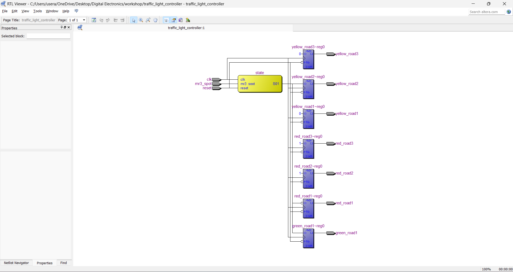
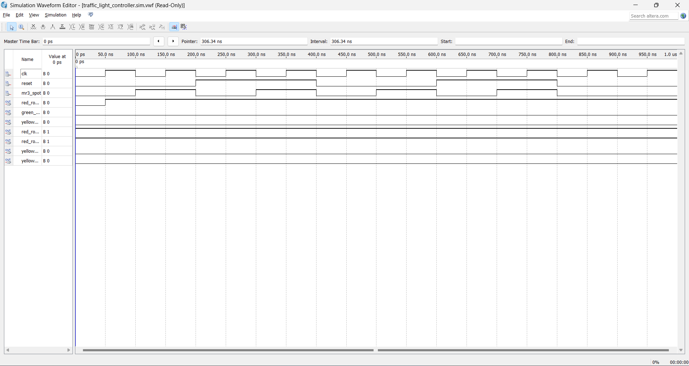

### Project-Based-Experiment

**AIM:**

To design and simulate the traffic light controller.

**SOFTWATE USED:**

Quartus II

**THEORY:**
	
     	Consider a controller for traffic at the intersection of three main roads.  

  


 The traffic signal for all the three main roads have equal priority and they remain red by default.

 In state 00,the traffic signals remains red for first five counts and yellow of road1 turns on for the next four counts.

 In state 01, the green of road1 turns on for first five counts and yellow of road1 and road2 turns on for next four4 counts of this state.
 
 In state 10, the traffic signal of road1 comes back to the red and that of road2 goes to green for tee first five counts.For the next four counts the traffic signal of road2 and road3 remains yellow.


 In state 11, the traffic signal of road2 comes back to the red and that of road3 goes to green for the first five counts.For the next four counts the traffic signal of road3 turns to yellow

 At the end of four states,the traffic signal of all the three roads come back to red.

**Task Assigned**

From the HDL code given formulate the correct code  to divert the traffic to path 1 direction and disable the control in other directions (Assume user is at MR3 spot)

**Procedure**

1.	Type the program in Quartus software.
2.	Compile and run the program.
3.	Generate the RTL schematic and save the logic diagram.
4.	Create nodes for inputs and outputs to generate the timing diagram.
5.	For different input combinations generate the timing diagram
   
**Program:**

/* Program to implement the given logic function and to verify its operations in quartus using Verilog programming. 

Developed by:SETHUKKARASI C<br>
RegisterNumber:212223230201*/
```
module traffic_light_controller(
    input clk,          // Clock input
    input reset,        // Reset input
    input mr3_spot,     // User spot at MR3
    output reg red_road1,   // Red light for road1
    output reg green_road1, // Green light for road1
    output reg yellow_road1, // Yellow light for road1
    output reg red_road2,   // Red light for road2
    output reg red_road3,   // Red light for road3
    output reg yellow_road2, // Yellow light for road2
    output reg yellow_road3  // Yellow light for road3
);

// Define state variables
reg [1:0] state;
parameter [1:0] S00 = 2'b00;
parameter [1:0] S01 = 2'b01;
parameter [1:0] S10 = 2'b10;
parameter [1:0] S11 = 2'b11;

// State machine logic
always @(posedge clk or posedge reset) begin
    if (reset) begin
        state <= S00; // Reset to initial state
    end else begin
        case(state)
            S00: begin
                // Default state, all red lights
                red_road1 <= 1'b1;
                green_road1 <= 1'b0;
                yellow_road1 <= 1'b0;
                red_road2 <= 1'b1;
                red_road3 <= 1'b1;
                yellow_road2 <= 1'b0;
                yellow_road3 <= 1'b0;
                
                // Transition conditions
                if (mr3_spot) begin
                    state <= S01; // Transition to S01 when user at MR3 spot
                end
            end
            S01: begin
                // Green light for road1, yellow for road1 and road2
                red_road1 <= 1'b0;
                green_road1 <= 1'b1;
                yellow_road1 <= 1'b0;
                red_road2 <= 1'b1;
                red_road3 <= 1'b1;
                yellow_road2 <= 1'b1;
                yellow_road3 <= 1'b0;
                
                // Transition conditions
                if (!mr3_spot) begin
                    state <= S00; // Transition back to S00 when user not at MR3 spot
                end
            end
            S10, S11: begin
                // All red lights
                red_road1 <= 1'b1;
                green_road1 <= 1'b0;
                yellow_road1 <= 1'b0;
                red_road2 <= 1'b1;
                red_road3 <= 1'b1;
                yellow_road2 <= 1'b0;
                yellow_road3 <= 1'b0;
                
                // Transition conditions
                if (mr3_spot) begin
                    state <= S01; // Transition to S01 when user at MR3 spot
                end
            end
        endcase
    end
end

endmodule

```

**RTL Schematic**


**Output Timing Waveform**


**Result:**<br>
Thus, a verilog HDL code is designed and simulated for the working of traffic light controller.


